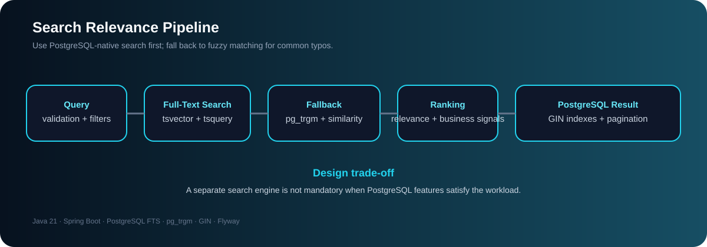

# Full Text Search API

A production-style Spring Boot REST API demonstrating PostgreSQL-native Full-Text Search, relevance ranking, fuzzy search, filtering, sorting, pagination, search suggestions, and database indexing.

---

## 📌 Project Overview

This project demonstrates how to build a powerful product search API using **PostgreSQL Full-Text Search** instead of introducing a separate search engine such as Elasticsearch.

The API supports:

1. **PostgreSQL Full-Text Search**
2. **Fuzzy Search fallback**

When a normal Full-Text Search doesn't return results, the API can fall back to PostgreSQL trigram-based fuzzy matching.

### Main Search Flow

```text
                    Search Request
                           |
                           v
                    Query Validation
                           |
                           v
                      PostgreSQL
                     Full-Text Search
                           |
                  +--------+--------+
                  |                 |
              Results            No Results
                  |                 |
                  |                 v
                  |           Fuzzy Search
                  |             pg_trgm
                  |                 |
                  +--------+--------+
                           |
                           v
                     Search Ranking
                           |
                           v
                        Filters
                           |
                           v
                         Sorting
                           |
                           v
                       Pagination
                           |
                           v
                    REST API Response
```

---

## 🧭 Engineering Case Study

| Concern | Design decision | Why it matters |
|---|---|---|
| Search engine choice | PostgreSQL Full-Text Search first | Keeps the stack simpler when database-native search fits |
| Typo tolerance | pg_trgm + word_similarity() fallback | Common misspellings still return useful candidates |
| Relevance | Text score + rating + review popularity | Ranking can reflect both lexical relevance and business signals |
| Performance | GIN indexes + pagination | Keeps retrieval efficient as the dataset grows |

<p align="center">
  
</p>


# 🚀 Features

- PostgreSQL Full-Text Search
- `tsvector`
- `websearch_to_tsquery()`
- `ts_rank()`
- PostgreSQL `pg_trgm`
- `word_similarity()`
- Fuzzy search fallback
- Search suggestions
- Relevance-based ranking
- Rating-based ranking
- Review-count based popularity ranking
- Brand filtering
- Category filtering
- Minimum price filtering
- Maximum price filtering
- Multiple sorting strategies
- Pagination
- Native PostgreSQL queries
- Spring Data JPA projections
- Flyway database migrations
- PostgreSQL GIN indexes
- Request validation
- Global exception handling
- Swagger/OpenAPI documentation

---

# 🛠 Tech Stack

| Technology | Purpose |
|---|---|
| Java 21 | Programming language |
| Spring Boot | Application framework |
| Spring Web | REST APIs |
| Spring Data JPA | Persistence |
| PostgreSQL | Database |
| PostgreSQL Full-Text Search | Text search |
| PostgreSQL pg_trgm | Fuzzy search |
| Flyway | Database migration |
| Maven | Build tool |
| Lombok | Boilerplate reduction |
| Swagger / OpenAPI | API documentation |

---

# 🏗 Architecture

```text
                         Client
                           |
                           v
                  ProductController
                           |
                           v
                   ProductService
                           |
             +-------------+-------------+
             |                           |
             v                           v
      Full-Text Search              Fuzzy Search
             |                           |
        tsvector                    pg_trgm
        tsquery                    word_similarity()
        ts_rank()                       |
             |                           |
             +-------------+-------------+
                           |
                           v
                    ProductRepository
                           |
                           v
                       PostgreSQL
                           |
                           v
                       products
```

---

# 📂 Project Structure

```text
full-text-search-api/
│
├── src/
│   ├── main/
│   │   ├── java/
│   │   │   └── com/rahul/api/
│   │   │       │
│   │   │       ├── config/
│   │   │       │   ├── OpenApiConfig.java
│   │   │       │   └── SearchConstants.java
│   │   │       │
│   │   │       ├── controller/
│   │   │       │   └── ProductController.java
│   │   │       │
│   │   │       ├── dto/
│   │   │       │   ├── ApiErrorResponse.java
│   │   │       │   ├── ProductRequest.java
│   │   │       │   ├── ProductResponse.java
│   │   │       │   ├── ProductSearchResponse.java
│   │   │       │   └── FuzzySearchResponse.java
│   │   │       │
│   │   │       ├── entity/
│   │   │       │   └── Product.java
│   │   │       │
│   │   │       ├── enums/
│   │   │       │   └── SearchSort.java
│   │   │       │
│   │   │       ├── exception/
│   │   │       │   ├── GlobalExceptionHandler.java
│   │   │       │   └── ProductNotFoundException.java
│   │   │       │
│   │   │       ├── repository/
│   │   │       │   ├── ProductRepository.java
│   │   │       │   └── projection/
│   │   │       │       ├── ProductSearchProjection.java
│   │   │       │       └── FuzzyProductProjection.java
│   │   │       │
│   │   │       └── service/
│   │   │           ├── ProductService.java
│   │   │           └── impl/
│   │   │               └── ProductServiceImpl.java
│   │   │
│   │   └── resources/
│   │       ├── db/
│   │       │   └── migration/
│   │       │       └── V1__create_products.sql
│   │       │
│   │       └── application.yml
│   │
├── pom.xml
├── README.md
└── .gitignore
```

---

# 🗄 Database

The project uses **PostgreSQL**.

Example database:

```sql
CREATE DATABASE fulltext_search;
```

---

# 🔌 PostgreSQL Extensions

The project uses the PostgreSQL `pg_trgm` extension for fuzzy search.

```sql
CREATE EXTENSION IF NOT EXISTS pg_trgm;
```

Verify:

```sql
SELECT extname
FROM pg_extension
WHERE extname = 'pg_trgm';
```

Expected:

```text
pg_trgm
```

---

# 📊 Product Table

The application works with product fields such as:

```text
id
title
description
brand
category
price
rating
review_count
search_vector
created_at
updated_at
```

The `search_vector` column stores the PostgreSQL Full-Text Search representation of searchable product data.

---

# 🔎 PostgreSQL Full-Text Search

PostgreSQL Full-Text Search is the primary search mechanism.

The searchable data is represented using:

```text
tsvector
```

and the user query is converted into:

```text
tsquery
```

The search condition is:

```sql
p.search_vector @@ websearch_to_tsquery(
    'english',
    :query
)
```

The `@@` operator determines whether the document matches the search query.

---

# 🧠 Why `websearch_to_tsquery()`?

The project uses:

```sql
websearch_to_tsquery()
```

instead of manually constructing a `tsquery`.

It provides search behavior closer to what users expect from a normal search box.

For example:

```text
iphone pro
```

can be converted into a PostgreSQL search query without manually constructing PostgreSQL operators.

---

# 📈 Search Ranking

Matching products are ranked using:

```sql
ts_rank()
```

Example:

```sql
SELECT
    p.id,
    p.title,
    ts_rank(
        p.search_vector,
        websearch_to_tsquery('english', :query)
    ) AS text_score
FROM products p
WHERE p.search_vector @@
      websearch_to_tsquery('english', :query)
ORDER BY text_score DESC;
```

---

# ⭐ Custom Relevance Score

The API goes beyond simple text relevance.

The final ranking combines:

```text
70% Text Relevance
20% Product Rating
10% Review Popularity
```

Formula:

```sql
(
    0.70 * ts_rank(
        p.search_vector,
        websearch_to_tsquery('english', :query)
    )
    +
    0.20 * COALESCE(p.rating, 0) / 5.0
    +
    0.10 * LEAST(
        LN(1 + COALESCE(p.review_count, 0)) / 10.0,
        1.0
    )
)
```

This allows the API to prioritize products that are both relevant and popular.

---

# 🧮 Why Combine Multiple Scores?

Consider two products:

```text
Product A
Text relevance = 0.90
Rating = 4.8
Reviews = 1000

Product B
Text relevance = 0.92
Rating = 3.0
Reviews = 5
```

If we only use text relevance:

```text
Product B > Product A
```

But with the combined ranking model:

```text
Text relevance
+
Rating
+
Popularity
```

Product A can receive the better overall ranking.

This is closer to how real-world product search systems can be designed.

---

# 🔤 Fuzzy Search

Users don't always type the correct spelling.

Example:

```text
Correct:
iphone
```

User enters:

```text
iphne
```

Full-Text Search may not return a useful result.

The API therefore provides a fuzzy-search fallback.

---

# 🧩 PostgreSQL `pg_trgm`

The project uses:

```text
pg_trgm
```

which provides trigram-based text similarity.

A trigram represents a sequence of three characters.

This allows PostgreSQL to calculate similarity between strings.

---

# 🔍 `word_similarity()`

The project uses:

```sql
word_similarity(
    LOWER(:query),
    LOWER(p.title)
)
```

Example:

```sql
SELECT
    title,
    word_similarity(
        LOWER('iphne'),
        LOWER(title)
    ) AS similarity
FROM products
ORDER BY similarity DESC;
```

This allows typo-tolerant matching.

---

# ⚡ Trigram `%` Operator

The fuzzy search also uses:

```sql
LOWER(p.title) % LOWER(:query)
```

as a candidate filter.

The fuzzy condition is approximately:

```sql
WHERE
    LOWER(p.title) % LOWER(:query)

    AND word_similarity(
        LOWER(:query),
        LOWER(p.title)
    ) >= :threshold
```

The purpose is:

```text
% operator
    ↓
Find suitable candidates

word_similarity()
    ↓
Calculate similarity

score
    ↓
Rank results
```

---

# 🗂 Database Indexes

Search performance depends heavily on indexes.

## Full-Text Search Index

```sql
CREATE INDEX IF NOT EXISTS idx_products_search_vector
ON products
USING GIN (search_vector);
```

The GIN index allows PostgreSQL to efficiently search the `tsvector` column.

---

## Fuzzy Search Index

```sql
CREATE INDEX IF NOT EXISTS idx_products_title_trgm
ON products
USING GIN (LOWER(title) gin_trgm_ops);
```

This index supports trigram-based searches.

---

# 🔄 Search Fallback Strategy

The main search endpoint follows this strategy:

```text
                    Query
                      |
                      v
             Full-Text Search
                      |
              +-------+-------+
              |               |
            Found          Not Found
              |               |
              |               v
              |          Fuzzy Search
              |               |
              +-------+-------+
                      |
                      v
                    Rank
                      |
                      v
                   Filter
                      |
                      v
                    Sort
                      |
                      v
                  Paginate
```

This gives us the benefits of Full-Text Search while still handling common spelling mistakes.

---

# 🔎 Search Filters

The search endpoint supports:

## Brand

```text
?brand=Apple
```

## Category

```text
?category=Smartphone
```

## Minimum Price

```text
?minPrice=50000
```

## Maximum Price

```text
?maxPrice=150000
```

Filters are applied to both:

```text
Full-Text Search
```

and:

```text
Fuzzy Search
```

This ensures that the fallback does not unexpectedly return products outside the user's requested filters.

---

# ↕️ Sorting

The API supports:

```text
RELEVANCE
PRICE_ASC
PRICE_DESC
RATING
NEWEST
```

## Relevance

```http
GET /api/v1/products/search?q=iphone&sort=RELEVANCE
```

## Price Ascending

```http
GET /api/v1/products/search?q=iphone&sort=PRICE_ASC
```

## Price Descending

```http
GET /api/v1/products/search?q=iphone&sort=PRICE_DESC
```

## Rating

```http
GET /api/v1/products/search?q=iphone&sort=RATING
```

## Newest

```http
GET /api/v1/products/search?q=iphone&sort=NEWEST
```

---

# 📄 Pagination

The API uses Spring Data `Pageable`.

Example:

```http
GET /api/v1/products/search?q=iphone&page=0&size=10
```

Example response:

```json
{
  "content": [
    {
      "id": 1,
      "title": "Apple iPhone 17 Pro"
    }
  ],
  "totalElements": 9,
  "totalPages": 1,
  "size": 10,
  "number": 0
}
```

Fuzzy fallback also supports pagination using:

```sql
LIMIT :limit
OFFSET :offset
```

---

# 🔮 Search Suggestions

The API supports lightweight search suggestions.

Example:

```http
GET /api/v1/products/suggestions?q=iph
```

Possible response:

```json
[
  "Apple iPhone 17 Pro",
  "Apple iPhone 17 Pro Max"
]
```

Suggestions are useful for implementing autocomplete functionality in a frontend application.

---

# 🔌 REST API Endpoints

## Product APIs

### Create Product

```http
POST /api/v1/products
```

Request:

```json
{
  "title": "Apple iPhone 17 Pro",
  "description": "Apple flagship smartphone",
  "brand": "Apple",
  "category": "Smartphone",
  "price": 129999
}
```

---

### Get All Products

```http
GET /api/v1/products
```

---

### Get Product by ID

```http
GET /api/v1/products/{id}
```

Example:

```http
GET /api/v1/products/1
```

---

### Update Product

```http
PUT /api/v1/products/{id}
```

Example:

```json
{
  "title": "Apple iPhone 17 Pro",
  "description": "Updated description",
  "brand": "Apple",
  "category": "Smartphone",
  "price": 125000
}
```

---

### Delete Product

```http
DELETE /api/v1/products/{id}
```

---

# 🔎 Search API

```http
GET /api/v1/products/search
```

Required parameter:

```text
q
```

Optional parameters:

```text
brand
category
minPrice
maxPrice
sort
page
size
```

Example:

```http
GET /api/v1/products/search?q=iphone
```

Example with filters:

```http
GET /api/v1/products/search?q=iphone&brand=Apple&category=Smartphone
```

Example with price range:

```http
GET /api/v1/products/search?q=iphone&minPrice=50000&maxPrice=150000
```

Example with sorting and pagination:

```http
GET /api/v1/products/search?q=iphone&sort=PRICE_ASC&page=0&size=10
```

---

# 🧪 Fuzzy Search API

```http
GET /api/v1/products/fuzzy-search
```

Example:

```http
GET /api/v1/products/fuzzy-search?q=iphne
```

Possible response:

```json
[
  {
    "id": 1,
    "title": "Apple iPhone 17 Pro",
    "brand": "Apple",
    "category": "Smartphone",
    "price": 129999,
    "textScore": 0.5
  }
]
```

---

# 💡 Search Examples

## Exact Query

```text
iphone
```

Expected matching products:

```text
Apple iPhone 17 Pro
Apple iPhone 17 Pro Max
```

## Typo Query

```text
iphne
```

The Full-Text Search may not return results.

The API can then perform fuzzy matching:

```text
iphne
  |
  v
pg_trgm
  |
  v
iPhone
```

---

# ⚠️ Validation

The API validates search queries.

For example:

```http
GET /api/v1/products/search?q=
```

returns:

```json
{
  "status": 400,
  "error": "Bad Request",
  "message": "Search query must not be empty"
}
```

Minimum and maximum query lengths are controlled centrally through `SearchConstants`.

---

# ❌ Error Handling

The API uses a global exception handler.

```text
@RestControllerAdvice
```

The following cases are handled:

- Invalid search query
- Invalid price range
- Product not found
- Request validation errors
- Unexpected server errors

Example:

```json
{
  "timestamp": "2026-08-19T20:00:00",
  "status": 404,
  "error": "Not Found",
  "message": "Product not found with id: 999",
  "path": "/api/v1/products/999"
}
```

---

# 🛫 Flyway

Database schema changes are managed using Flyway.

Migration files are located under:

```text
src/main/resources/db/migration/
```

Example:

```text
V1__create_products.sql
```

Flyway automatically executes pending migrations during application startup.

---

# ⚙️ Configuration

Example `application.yml`:

```yaml
spring:
  datasource:
    url: jdbc:postgresql://localhost:5432/fulltext_search
    username: ${DB_USERNAME:postgres}
    password: ${DB_PASSWORD:postgres}

  jpa:
    hibernate:
      ddl-auto: validate

  flyway:
    enabled: true
```

Use environment variables for real credentials.

Do not commit production passwords to GitHub.

---

# ▶️ Running the Application

## Prerequisites

Install:

- Java 21
- Maven
- PostgreSQL

Verify Java:

```bash
java -version
```

Verify Maven:

```bash
mvn -version
```

---

## 1. Create Database

```sql
CREATE DATABASE fulltext_search;
```

---

## 2. Enable PostgreSQL Extension

```sql
CREATE EXTENSION IF NOT EXISTS pg_trgm;
```

---

## 3. Configure Database

Set:

```text
DB_USERNAME
DB_PASSWORD
```

or configure your local `application.yml`.

---

## 4. Start Application

```bash
mvn spring-boot:run
```

Application:

```text
http://localhost:8080
```

---

# 📚 Swagger / OpenAPI

Swagger UI:

```text
http://localhost:8080/swagger-ui/index.html
```

OpenAPI specification:

```text
http://localhost:8080/v3/api-docs
```

Swagger provides an interactive way to execute and test the APIs.

---

# 🧠 Important Concepts Learned

## PostgreSQL

- Full-Text Search
- `tsvector`
- `tsquery`
- `websearch_to_tsquery`
- `ts_rank`
- `pg_trgm`
- `word_similarity`
- `%` trigram operator
- GIN indexes
- Native SQL
- `EXPLAIN ANALYZE`

## Spring Boot

- REST controllers
- Service layer
- Repository layer
- Spring Data JPA
- Native queries
- Interface projections
- Pageable
- DTOs
- Validation
- Global exception handling

## API Design

- Search filters
- Sorting
- Pagination
- Search fallback
- Relevance ranking
- Error responses

---

# 🔬 Performance Considerations

The project uses PostgreSQL indexes specifically designed for the search workload.

Full-Text Search:

```sql
GIN(search_vector)
```

Fuzzy search:

```sql
GIN(LOWER(title) gin_trgm_ops)
```

Use:

```sql
EXPLAIN ANALYZE
```

to verify query plans and index usage.

Example:

```sql
EXPLAIN ANALYZE
SELECT
    id,
    title
FROM products
WHERE search_vector @@
      websearch_to_tsquery('english', 'iphone');
```

---

# 🆚 PostgreSQL FTS vs LIKE

A simple search might use:

```sql
WHERE LOWER(title) LIKE '%iphone%'
```

However, Full-Text Search provides features such as:

- Tokenization
- Normalization
- Ranking
- Language-aware search
- Search operators
- GIN indexing

Therefore:

```text
LIKE
```

is useful for simple substring matching, while:

```text
Full-Text Search
```

is better suited for richer text-search requirements.

---

# 🆚 PostgreSQL FTS vs Elasticsearch

This project intentionally uses PostgreSQL.

### PostgreSQL advantages

- Existing database infrastructure
- No additional search cluster
- ACID transactions
- Simple deployment
- Native SQL
- GIN indexes
- Full-Text Search
- Trigram fuzzy search

### Elasticsearch/OpenSearch may be preferred when

- Search volume is extremely large
- Advanced search capabilities are required
- Distributed search is required
- Complex relevance models are required
- Search analytics are extensive

The appropriate solution depends on the application's scale and requirements.

---

# 🎯 Interview Explanation

A concise explanation of this project:

> I implemented a product search API using PostgreSQL Full-Text Search. Product data is indexed into a `tsvector` column and queries are generated using `websearch_to_tsquery()`. Results are ranked using `ts_rank()` and a custom score that combines text relevance, product rating and review popularity. If Full-Text Search doesn't find results, the API falls back to PostgreSQL `pg_trgm` fuzzy search using `word_similarity()`. I also implemented filtering, sorting, pagination, GIN indexes, native queries and Swagger documentation.

---

# 💬 Interview Questions

### 1. Why use PostgreSQL Full-Text Search?

To provide efficient text searching and ranking directly inside PostgreSQL without requiring a separate search engine.

### 2. What is `tsvector`?

A normalized representation of searchable text used by PostgreSQL Full-Text Search.

### 3. What is `tsquery`?

A PostgreSQL representation of a search query used to match against a `tsvector`.

### 4. What does `@@` do?

It checks whether a `tsvector` matches a `tsquery`.

### 5. What is `ts_rank()`?

It calculates the relevance score of a matching document.

### 6. Why use `websearch_to_tsquery()`?

It provides search syntax that is more natural for user-entered search strings.

### 7. What is `pg_trgm`?

A PostgreSQL extension providing trigram-based similarity operations and indexes.

### 8. Why use `word_similarity()`?

To find text that is similar even when the user makes spelling mistakes.

### 9. Why use a GIN index?

GIN indexes efficiently support PostgreSQL Full-Text Search and trigram-based searches.

### 10. Why use native SQL?

PostgreSQL-specific features such as:

```text
ts_rank()
websearch_to_tsquery()
word_similarity()
```

are database-specific and are easier to express using native SQL.

### 11. Why use projections?

Search queries often return calculated values such as:

```text
textScore
score
titleHighlight
descriptionHighlight
```

Interface projections allow the application to retrieve only the required columns instead of loading complete entities.

### 12. How does fuzzy fallback work?

The API first performs Full-Text Search.

If there are no results, it executes trigram-based fuzzy search and returns similar products.

---

# 🔮 Future Improvements

Potential future enhancements include:

- Search title + description + brand
- PostgreSQL dictionaries
- Synonym support
- Search highlighting
- Advanced autocomplete
- Search analytics
- Popular search tracking
- Redis caching
- Search result caching
- Elasticsearch/OpenSearch migration for very large workloads
- Advanced ranking models
- Multi-language search
- Search typo correction
- Search history

---

# 🔐 Security

This project focuses primarily on PostgreSQL search concepts.

Authentication and authorization can be integrated using Spring Security/JWT when required.

---

# 📝 Project Status

```text
✅ Product CRUD
✅ PostgreSQL database
✅ Flyway migration
✅ Full-Text Search
✅ tsvector
✅ tsquery
✅ websearch_to_tsquery()
✅ ts_rank()
✅ Custom relevance score
✅ Brand filtering
✅ Category filtering
✅ Price filtering
✅ Pagination
✅ Sorting
✅ Fuzzy search
✅ pg_trgm
✅ word_similarity()
✅ Search suggestions
✅ GIN indexes
✅ Validation
✅ Global exception handling
✅ Swagger/OpenAPI
✅ GitHub README
```

---

# 📌 Learning Outcome

After completing this project, you should understand how to implement a production-style search API using PostgreSQL without immediately introducing a dedicated search engine.

The most important concepts demonstrated are:

```text
PostgreSQL Full-Text Search
        +
Relevance Ranking
        +
Fuzzy Search
        +
Database Indexing
        +
Filtering
        +
Sorting
        +
Pagination
        +
Spring Boot REST API
```

---

# 👨‍💻 Author

**Rahul Moundekar**

Java Backend Developer

Technologies:

```text
Java
Spring Boot
Microservices
REST APIs
PostgreSQL
JPA
Docker
Cloud
```

---

# 📄 License

This project is intended for learning, portfolio and interview demonstration purposes.
